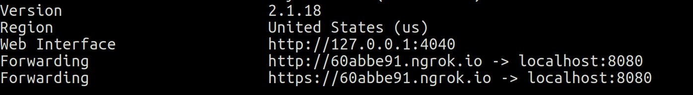
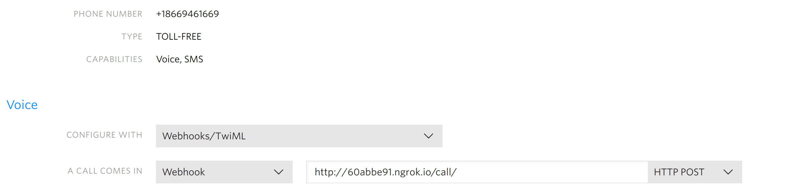

twilio-voice
===
Twilio-voice is like a Google Voice clone that you can run yourself.  It allows you to forward a virtual number to a phone of your choice (cell or landline).  If you miss a call, it will send you a voicemail transcription and a link to the audio to your email.

**Why would I need this?**

Here are some ideas:

* You have a side business but not a separate phone line.  You want to have a business or toll-free number that forwards to your cell phone.

* You're selling something online and you want people to be able to contact you, but you don't want to give out your cell phone number.  You can get rid of your virtual number after you sell it and the other party will never know your real number.

* You want to use Google Voice but you live outside the U.S.  This works in the [50+ countries](https://support.twilio.com/hc/en-us/articles/223183068-Twilio-international-phone-number-availability-and-their-capabilities) in which Twilio offers inbound numbers.

If you like this project but need more business features, check out getcontext.io which is aimed at the needs of small businesses and entrepreneurs.

### Prerequisites

You'll need the following in order to get this running:

1. A Twilio account
2. A Mailgun account (in order to receive voicemail notifications)
3.  A Linux or OS X computer to run the twilio-voice server.  You can run it on your own computer with [ngrok](https://ngrok.io) or get a cheap cloud server from Linode, Digital Ocean, Vultr, etc.
4.  Your own domain (in order to receive voicemail notifications)

### Does this cost money?

Yes, you'll have to pay a per-minute fee for every call, a monthly fee for your virtual phone number, and a few cents per voicemail transcription.  It should be under $10/month unless your phone is ringing off the hook.

### Getting it running

First, sign up for a Twilio account and buy a virtual number from the console after you fund your account.  If you have a Linux or OS X computer, download ngrok.

From the terminal start ngrok:

```
ngrok http 8080
```

Take note of your generated URL listed under Forwarding:



In the Twilio console, enter this URL with the route `/call/` tacked on the end.  Make sure you end with the final `/` so from the screen shot above I would enter:

```
http://60abbe91.ngrok.io/call/
```

Like in this screenshot:



Almost there.  Now, sign up for a [Mailgun](https://mailgun.com) account, which is free.  You'll need to be able to enter DNS records to enable email delivery for your domain.  Follow the directions for setting up your Mailgun account, then take note of your API keys.  

Now, all you need to do is download the pre-built binary from the releases page that's appropriate for your system.

From the command line, run

```
./twilio-voice
```

And, it probably didn't work, but that's because we haven't configured it.

### Configuration

Configuration is done via environment variables.  If you're handy on the command line, you know how to do this.  If not, open a file in a text editor and call it env.sh.  Enter the following details:

```
export MAILGUN_PUBLIC_KEY="your MG public key"
export MAILGUN_SECRET_KEY="your secret key"
export MAILGUN_DOMAIN="domain you registered with MG"
export FORWARDING_NUMBER="number you want the calls to forward to"
export NOTIFICATION_EMAIL="your email"
export VOICEMAIL_SCRIPT="what you want the voicemail prompt to say"
export VOICEMAIL_FILE="relative path to a file you want to play for the VM prompt"
```

Now run 

```
source env.sh
./twilio-voice
```

If everything is set up correctly, you'll see that it's running a server on port 8080, which Twilio can access via ngrok on your home computer.

Give it a test by calling your virtual number.  It should ring your phone.  Don't answer it and wait for the voicemail prompt.  Leave a message and wait for the transcription to come to your inbox. 

That's it!

### How it works

Twilio will call your server to figure out what to with your call.  What this project does is run a simple server that responds with the commands necessary for Twilio to forward the incoming call to your phone. If you don't pick up or it's busy, it will either read your voicemail script or play your custom message and record the caller's voicemail.  Once the transcription is ready, it will send you the email with the transcription via Mailgun.

If you want to see how it works under the hood, open your browser to http://127.0.0.1:4040.  You'll see the series of requests made by Twilio and this server responding to connect the call.

### Limitations

1.  You cannot make an outgoing call and have it appear to come from your virtual number (yet)
2.  No SMS or MMS (yet)
3.  The forwarded calls appear to come from your virtual number.  This is by design, so you can tell that it's a forwarded call.

### Developers

Check out my Go [TwiML library](https://github.com/BTBurke/twiml) if you want to build additional features.
